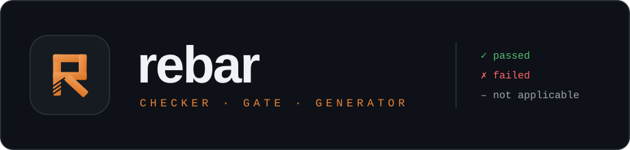
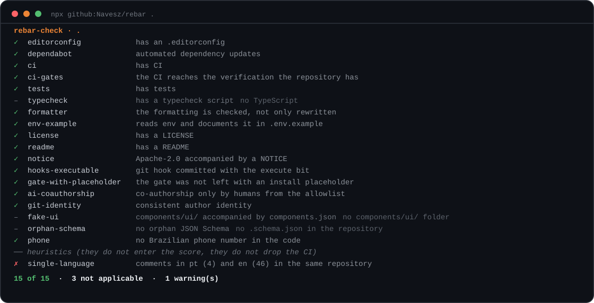

# rebar



> **Hace que el código incorrecto no pase.** Un verificador que se ejecuta contra cualquier
> repositorio, una compuerta que bloquea el commit cuando se ignora una regla, y un generador
> que construye el próximo proyecto ya del lado correcto de la regla.

[](https://github.com/Navesz/rebar/actions/workflows/verificar.yml)
[](LICENSE)
[](#qué-verifica)
[](#la-compuerta)
[](ESTADO.md)

[Read in English](README.md) · [Leia em português](README.pt-BR.md) ·
[Sitio](https://navesz.github.io/rebar-site/) · [Estado del proyecto](ESTADO.md) ·
[Plan](docs/PLANO.md)



Esa es la salida real, generada de la ejecución — no una captura dibujada a mano.
Son tres estados, y el tercero es lo que impide que el marcador mienta: una regla que
no aplica imprime `–` **con el motivo** y sale del denominador, en vez de contar como
una aprobación que no se ganó.

```bash
npx github:Navesz/rebar .                    # auditar lo que ya existe
npx github:Navesz/rebar new padaria-do-ze   # empezar del lado correcto
```

Cero dependencias en tiempo de ejecución. El verificador nunca escribe en el repositorio que
audita.

---

## El problema, medido

Este proyecto nació de una queja concreta:

> Todos los sitios que pido que usen el estándar como referencia — mucho se ignora, queda
> hardcodeado, se olvida algo del stack, se pone a la IA como coautora, se olvida shadcn.

La respuesta habitual es escribir mejor la regla. No funciona, y se puede medir. En un análisis
forense de **161 commits en seis repositorios**:

| Medición | Resultado |
|---|---|
| Repositorios sin CI | 3 de 6 |
| Repositorios con lint roto ahora mismo | **los mismos 3** |
| Commits con coautoría de IA | 41 de 161 (25,5%) |
| Repositorio con más documentos de gobernanza | **35 errores de lint** |

_Medición histórica del 25/08/2026, tomada en los otros repositorios de la máquina del dueño.
No es propiedad de este árbol, no es derivable desde aquí, y no debe actualizarse: es la
evidencia que originó el proyecto, con la fecha en que se recogió._

Esa última fila es el caso que decide el diseño. Tenía `AGENTS.md` con "Hard rules",
`SECURITY.md`, `GOVERNANCE.md`, `CONTRIBUTING.md`, y un script `check` que encadenaba formato,
lint, tipos, prueba y build. **Nada ejecutaba nunca ese `check`.**

> Una regla escrita en markdown tiene un cumplimiento cercano a cero. Una regla en CI tiene
> 100%.

De ahí la tesis: **si una regla puede bajar de nivel, debe bajar — pero la imposición tiene que
ser más confiable que la regla que reemplaza.**

## Tres estados, y el tercero es el que impide que el marcador mienta

```
rebar-check · prumo
  ✓ editorconfig       tiene .editorconfig
  ✗ dependabot         actualización de dependencias automatizada  sin dependabot ni renovate
  ✓ ci                 tiene CI
  ✓ ci-gates           el CI alcanza la verificación que el repositorio declara
  – typecheck          tiene script de typecheck  no tiene TypeScript
  11 de 13  ·  1 no aplica
```

_Salida de ejemplo contra `prumo`, medida el 30/08/2026. Ilustra el formato; no es el marcador
de este árbol._

**"No aplica" sale del denominador.** Antes de que ese estado existiera, una carpeta vacía con
un `.git/` vacío sacaba 8 de 14 — empatando con el propio rebar y superando al repositorio más
estricto de la máquina. La nada no cumple; la nada no aplica.

### Códigos de salida

| | |
|---|---|
| `0` | todo lo aplicable pasó |
| `1` | falló — violación real |
| `2` | objetivo inválido o invocación errónea |
| `127` | **se rompió** — una regla lanzó una excepción |

El `127` domina al `1`: no se acusa a un repositorio con una regla que se rompió.

## Qué verifica

Son <!--n rules.total-->23<!--/n--> reglas en dos clases.

**<!--n rules.deterministicas-->18<!--/n--> determinísticas** derriban el código de salida:

Son estas: <!--n rules.lista-deterministicas-->`editorconfig` · `dependabot` · `ci` · `ci-gates` · `tests` · `typecheck` · `formatter` · `env-example` · `license` · `readme` · `notice` · `hooks-executable` · `gate-with-placeholder` · `ai-coauthorship` · `git-identity` · `fake-ui` · `orphan-schema` · `phone`<!--/n-->

**<!--n rules.heuristicas-->5<!--/n--> heurísticas** solo informan, y la separación es medida, no estética:

Son estas: <!--n rules.lista-heuristicas-->`content-outside-code` · `shadcn-complete` · `production-url` · `raw-hex` · `single-language`<!--/n-->

La regla ingenua de color literal, medida en un repositorio real, dio **7 ocurrencias y cero
verdaderos positivos** — cinco eran comentarios que documentaban la propia regla. Una regla
automática equivocada cuesta más que una regla ausente, y una heurística que bloquea enseña a
apagar la salida entera.

### Toda regla nace con dos casos

Son <!--n proofs.casos-->60<!--/n--> casos, un par por regla, y las <!--n rules.total-->23<!--/n--> reglas están cubiertas:

```bash
npm run prove
```

Cada caso arma un repositorio en miniatura en un directorio temporal, con su propio
`git init`, y comprueba el **estado** de la regla — pasó, falló, no aplica o se rompió. Nunca
escribe en el repositorio vivo.

Leer solo el código de salida no bastaba: `pasó` y `no aplica` salen ambos como `0`, así que
**13 de las 20 reglas eran improbables por construcción** — medido el 30/08/2026, cuando las
reglas eran 20. Hoy, restaurar a mano cualquiera de esas 13 ramas hace fallar la suite.

## Las tres reglas

| Comando | Qué responde | Qué no hace |
|---|---|---|
| `npx github:Navesz/rebar .` | ¿El repositorio tiene la forma correcta? | No mira seguridad, no ejecuta la aplicación |
| `npx -p github:Navesz/rebar rebar-security .` | ¿Tiene una falla de seguridad? | No verifica Broken Access Control — el nº 1 de OWASP |
| `npx github:Navesz/rebar new <nombre>` | Empezar un proyecto ya con compuerta | Un solo preset: `site` |

El `-p` del segundo no es un detalle. Sin él `npx` ejecuta el bin por defecto del paquete — el
verificador de formato — y el paso de la "regla de seguridad" repite el de arriba sin que nadie
lo note.

**`rebar-security` es honesto sobre su agujero.** IDOR y autorización por objeto quedaron fuera
porque la defensa casi siempre vive en un middleware, una policy o RLS: dos árboles idénticos
byte a byte en disco pueden tener veredictos opuestos. Decirlo es más útil que fingir que
verifica.

## La compuerta

El verificador es una de las capas, no la única.

| Capa | Qué | Quién bloquea |
|---|---|---|
| **N5** | `pre-commit` — secreto en stage y coautoría | git, en tu máquina |
| **N5** | `commit-msg` — coautoría de IA | git, antes de que el commit exista |
| **N4** | CI en matriz Windows + Linux, ejecutando el `verify` entero | GitHub Actions |
| **N4s** | ruleset con check obligatorio | **el servidor** |

`npm run verify` **no es una capa nueva**: es la secuencia que ejecuta el N4 y que se ejecuta
antes que él, hoy con <!--n verify.passos-->22<!--/n--> pasos.

En orden: <!--n verify.lista-passos-->`hygiene` · `hooks` · `commit-msg` · `syntax` · `blocks` · `mcp-server` · `mcp` · `numbers` · `format` · `links` · `secret` · `secret-proofs` · `steps` · `strip` · `proofs` · `generator-map` · `generator-identity` · `mcp-template` · `security` · `security-table` · `security-self` · `self`<!--/n-->

El N4s existe porque todo lo que está debajo vive en un archivo que el agente edita: el
workflow lo borra, el `core.hooksPath` lo quita sin dejar diff. Solo el ruleset resiste — y
aquí está con `bypass_actors: []`, así que ni el dueño pasa por encima.

```bash
npm run verify          # la secuencia entera, un comando
npm run install-hooks   # apunta core.hooksPath a tooling/hooks
```

### El paso que faltaba, y lo que costó su ausencia

En un renombrado, `aplicar.mjs` pasó a leer `verify.yml` de una carpeta donde el archivo se
llama `verificar.yml`. **`rebar new` murió con ENOENT** — y `npm run verify` siguió en verde
durante seis commits, porque ningún paso generaba un proyecto. El verificador se prueba, las
reglas se prueban, el MCP se prueba, la compuerta se prueba por mutación — y el producto no.

`generator-map` cierra eso, y está probado por mutación: replantar el defecto original hace
que dos de sus cinco pruebas fallen con el mensaje exacto.

## El MCP

El proyecto generado lleva un servidor que lee sus propias reglas, para que la IA que lo abra
sea avisada antes de escribir, y no después.

El artefacto es **derivado, nunca duplicado**: `npm run verify` lo regenera en memoria y falla
si el disco diverge. Es imposible cambiar una regla y olvidar el MCP.

Lleva <!--n mcp.artefato.regras-->26<!--/n--> reglas de dos módulos, <!--n mcp.artefato.passos-->22<!--/n--> pasos de compuerta y <!--n mcp.artefato.provas-->64<!--/n--> pruebas, expuestos en <!--n mcp.ferramentas-->5<!--/n--> herramientas.

## Mapa del repositorio

| Ruta | Qué |
|---|---|
| `tooling/rebar-check/` | la regla de formato y sus <!--n proofs.casos-->60<!--/n--> casos de prueba |
| `tooling/security/` | la regla de seguridad |
| `tooling/verify/` | el ejecutor de la compuerta y las pruebas por mutación de sus pasos |
| `tooling/secret/` | el escáner de secretos, y las seis pruebas de detección |
| `new/` | el generador: plantillas, compuerta, y las pruebas del mapa de archivos |
| `mcp/` | el artefacto generado y el servidor que lo sirve |
| `docs/PLANO.md` | el manuscrito único: taxonomía, decisiones y la revisión adversarial |
| `ESTADO.md` | lo que está hecho, lo que falta, y lo que no está probado |

## Lo que este proyecto no hace

Declarar el límite vale más que declarar la capacidad, así que:

- No verifica **Broken Access Control**, el nº 1 de OWASP. Está fuera del alcance de un
  verificador estático, y está escrito así.
- No ejecuta tu aplicación. Toda regla decide sobre un repositorio en reposo.
- Tiene **un solo preset de generador**, `site`. `app` y `api` están bloqueados por un
  no-alcance declarado hasta que `site` se use sin modificación en dos sitios.
- Una heurística sigue solo avisando porque cerca del 12% de lo que señala es vocabulario de
  interfaz. Si eso no cambia, el criterio de abandono manda parar.

## Apoyo

No hay destino de donación, y no lo habrá hasta que el dueño del repositorio active y verifique
uno. La contribución útil hoy es ejecutar la regla contra un repositorio tuyo y abrir un issue
con la salida — un falso positivo reportado vale más que una regla agregada.

## Licencia

[Apache-2.0](LICENSE), con el aviso de atribución en [NOTICE](NOTICE).

La coautoría de IA se bloquea mediante una allowlist de humanos en
[`.rebar-coauthors`](.rebar-coauthors), impuesta por el hook `commit-msg` antes de que el
commit exista y por la regla `ai-coauthorship` sobre el historial después.
